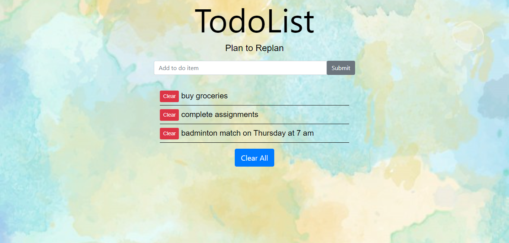

# ToDo List

A simple application to plan and organize tasks with features to add and delete tasks.



## Technology Stack
* **Frontend**: [HTML](https://html.com/), [CSS](https://developer.mozilla.org/en-US/docs/Web/CSS), [Bootstrap](https://getbootstrap.com/)
* **Backend**: [Node](https://nodejs.org/en/about/), [Express](https://expressjs.com/)
* **Datbase**: [MongoDB](https://docs.mongodb.com/)


## Prerequisite

1. **Node.js** : 
Install Node.js from the [official website](https://nodejs.org).

2. **Docker** : 
   - Install Docker Desktop for [Windows](https://docs.docker.com/desktop/windows/install/)
   - Install Docker Desktop for [Mac](https://docs.docker.com/desktop/mac/install/)
   - Install Docker for [Linux](https://docs.docker.com/engine/install/)

3. **Docker Compose** : 
For Linux install [Docker compose](https://docs.docker.com/compose/install/).
>Note : Docker Desktop for Windows and Mac already has Docker Compose. So no need to install it separately.


## Dependencies
* Initialize the project and create the package. json file
    ```bash
    npm init
    ```
* Install Express
    ```bash
    npm install express --save
    ```
* Install Embedded Javascript Template
    ```bash
    npm install ejs --save
    ```

* Install body-parser
    ```bash
    npm install body-parser --save
    ```

* Install mongoose
    ```bash
    npm install mongoose --save
    ```
Note : *--save* installs the package and updates the dependencies in your package. json

## Run the application using Docker Compose

**Docker**
: Docker is an open source centralized container platform designed to create,deploy and run applications quickly. It is highly efficient and easy to scale up.
For more information [click here](https://docs.docker.com/get-started/overview/).

**Dockerfile**
: It is a text file which contains set of instructions to build the image.
In simplet terms, it is like a recipe with all ingredients and steps necessary in making a dish.

**Docker-compose**
: Docker Compose is a tool for defining and running multi-container docker applications.


### Validate and view the compose file (Optional)

```bash
docker-compose config
```

### 1. Start the application
Builds, (re)creates, starts and attaches to containers for service

```bash
docker-compose up
```

Note
: *docker-compose up -d* starts the containers in the background and leaves them running.

### 2. Stop the application
Stops and removes containers, networks and images created

```bash
docker-compose down
```

## License
This project is licensed under the MIT License. Learn more about it in the [LICENSE](LICENSE) file.

